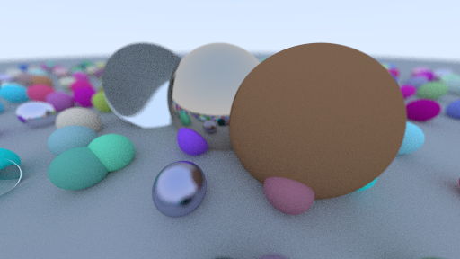
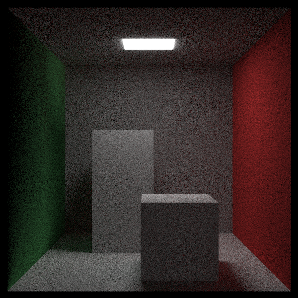

<!-- PROJECT LOGO -->
 

  

  <h3 align="center">DenoTracer</h3>

  

    Basic CPU pathtracer built with Typescript and Deno

<!-- ABOUT THE PROJECT -->

## About The Project

This project started as a hobby to dive myself depper into computer graphic and finaly write my own pathtracer.
The choice of programming language is probably not the smartest one to write a a pathtracer, 
since javascript is single-threaded but javascript is my main language so why not?
No optimization done while writing the project and heavily inspired by the raytracing in one weekend series.
Since it would take ages to get a clear image, all sample images are with low res low samples(around 100-300) depending on the scene.
While I was going trough the project I learned so much about vectors, bounding boxes and the basic concept of tracing with rays and constructing an image.
Time to time I do some small refactors fot the project but my next step will be to dive myself into raymarching or even WEBGL to write a better performing
pathtracer.

### Features
 
* Multiple material handling (Dialectric, Lambertian, Metal, even a checkerMaterial)
* Antialiasing
* Depth of field
* plane, sphere and box geometry

## Sample Images

  
  

  
  
 600 samples 

<!-- ACKNOWLEDGMENTS -->
## Acknowledgments

Resources that I took inspiration and help from.

* [RayTracing In OneWeekend](https://raytracing.github.io/books/RayTracingInOneWeekend.html)
* [Introduction to ray tracing](https://www.scratchapixel.com/lessons/3d-basic-rendering/introduction-to-ray-tracing/ray-tracing-practical-example)
* [A Minimal Ray-Tracer: Rendering Simple Shapes](https://www.scratchapixel.com/lessons/3d-basic-rendering/minimal-ray-tracer-rendering-simple-shapes/ray-sphere-intersection)
* [Introduction to Shading](https://www.scratchapixel.com/lessons/3d-basic-rendering/introduction-to-shading/diffuse-lambertian-shading)
