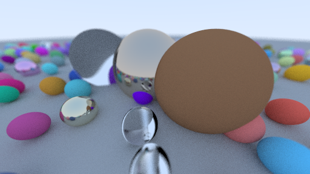

<!-- PROJECT LOGO -->
 

  

  <h3 align="center">DenoTracer</h3>

  

    Basic CPU raytracer built with Typescript and Deno

<!-- ABOUT THE PROJECT -->

  
  
 Sphere demonstration - 100 samples used

  
  
 Sphere demonstration - 100 samples used - Denoised

## About The Project
This project started as hobby learning the basics of raytracing, using typescript.
Probably not the fastest and most effiecent raytracer on the net, but it's still does the job.
The whole project is still in development as I'm still learning the fundamentals of raytracing.

(<a href="#top">back to top</a>)

### Features
 
 Current features of the raytracer.

* Multiple material handling (Dialectric, Lambertian, Metal)
* Antialiasing
* Depth of field
* Basic sphere object

(<a href="#top">back to top</a>)

<!-- ROADMAP -->
## Roadmap

- [ ] Add More objects
- [ ] Speed up Rendering (refactor the core raytracer)
- [ ] Better Dialectric material
- [ ] More Material type
- [ ] Better option handling
- [ ] Iteration instead of recursion?
- [ ] Refactor Vector3 class
- [ ] Use GPU instead of CPU
- [ ] Axis aligned bounding box
- [ ] Lighting

(<a href="#top">back to top</a>)

<!-- ACKNOWLEDGMENTS -->
## Acknowledgments

Resources that I took inspiration and help from.

* [RayTracing In OneWeekend](https://raytracing.github.io/books/RayTracingInOneWeekend.html)
* [Introduction to ray tracing](https://www.scratchapixel.com/lessons/3d-basic-rendering/introduction-to-ray-tracing/ray-tracing-practical-example)
* [A Minimal Ray-Tracer: Rendering Simple Shapes](https://www.scratchapixel.com/lessons/3d-basic-rendering/minimal-ray-tracer-rendering-simple-shapes/ray-sphere-intersection)
* [Introduction to Shading](https://www.scratchapixel.com/lessons/3d-basic-rendering/introduction-to-shading/diffuse-lambertian-shading)

(<a href="#top">back to top</a>)

